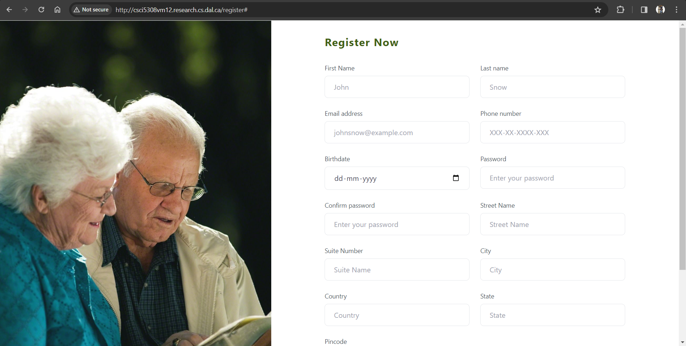
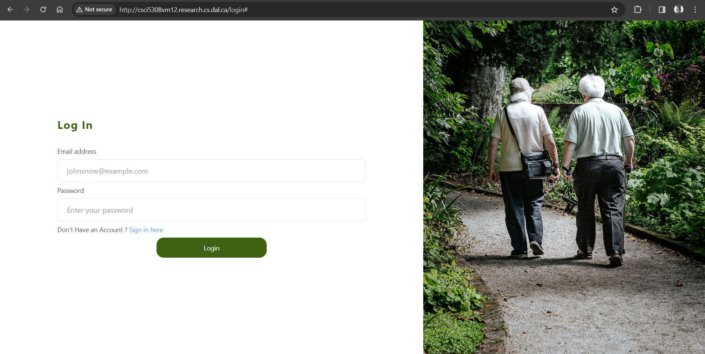
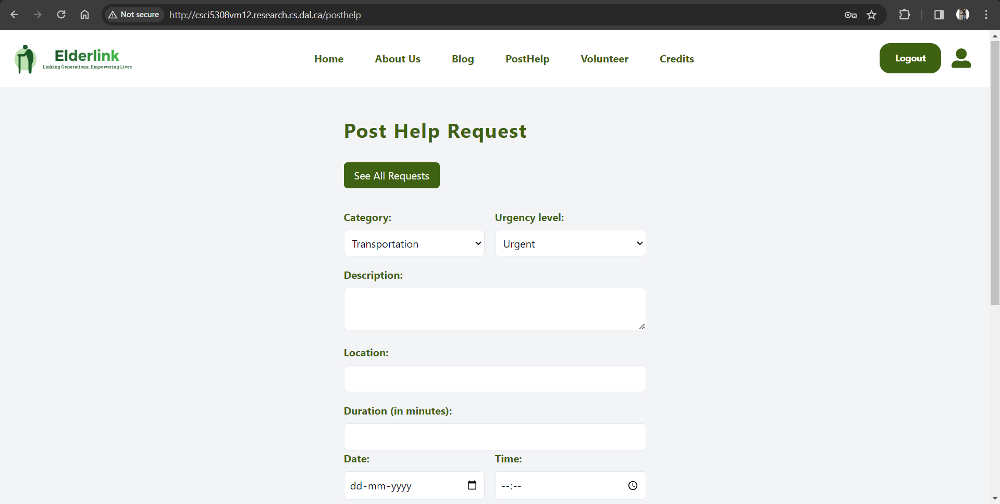
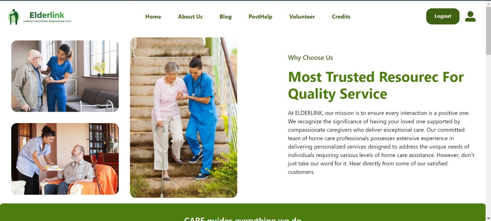
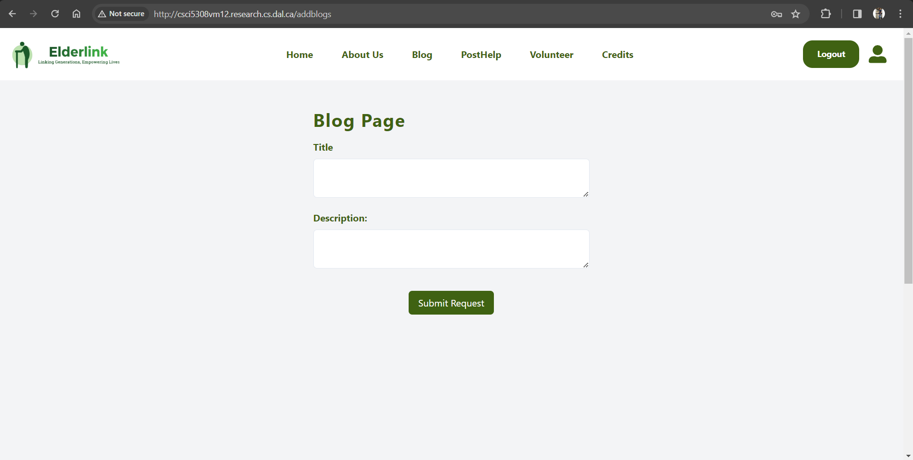
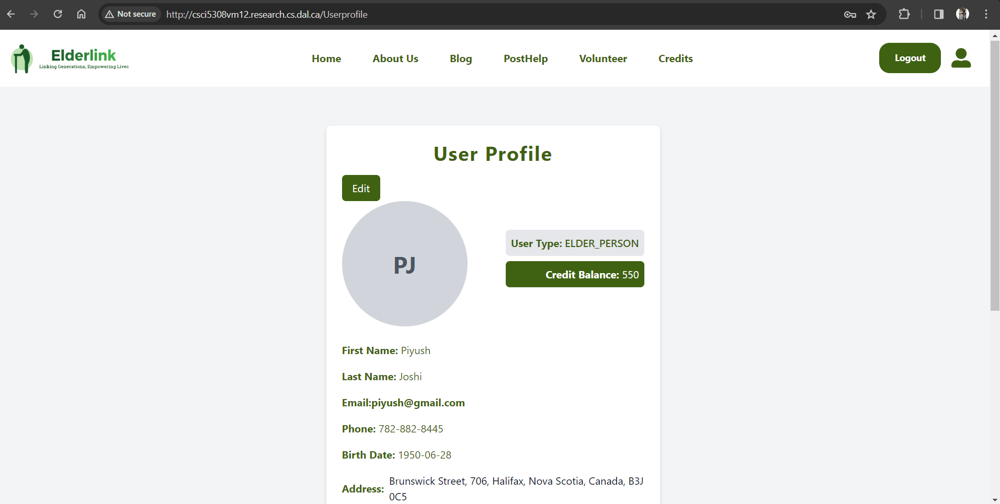
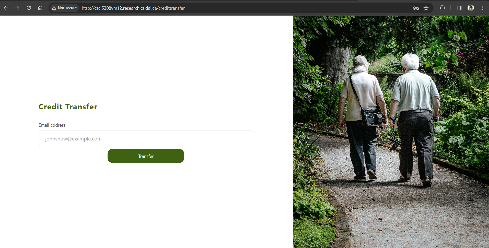
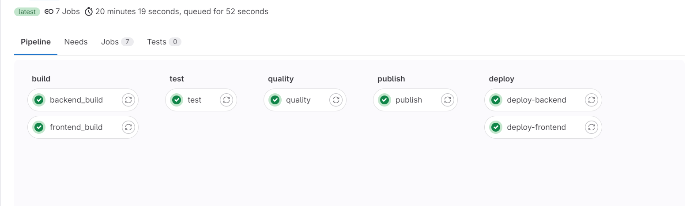

# ElderLink: A Community-Focused Platform

EElderLink is a community-focused platform designed to bridge the gap between elders in need of assistance and willing volunteers, integrating a credit-based reward system. Initially, elders are allocated credits which serve as a token of appreciation for the volunteers' time and efforts. Upon successfully receiving help, elders transfer credits to volunteers, commensurate with the hours of assistance provided. Elders can easily request help through a simple form, and these requests become visible to a network of volunteers. When a volunteer accepts a request, the elder is notified and given the volunteer's details, offering the elder the option to select the volunteer they feel most comfortable with. This system not only ensures that elders receive the personalized support they need but also incentivizes volunteers by recognizing their valuable contributions, thereby fostering a supportive, engaged, and rewarding community ecosystem.

## Table of Contents

- [Introduction](#introduction)
- [Technologies Used](#technologies-used)
- [Getting Started](#getting-started)
  - [Prerequisites](#prerequisites)
  - [Installation](#installation)
    - [Frontend Setup](#frontend-setup)
    - [Backend Setup](#backend-setup)
- [Usage Scenario](#usage-scenario)
  - [Features](#features)
    - [For Elder Persons](#for-elder-persons)
    - [For Volunteers](#for-volunteers)
- [Website Navigation](#website-navigation)
  - [Registration Page](#registration-page)
  - [Login Page](#login-page)
  - [Post Help](#post-help)
  - [About Us](#about-us)
  - [Blogs](#blogs)
  - [User Profile](#user-profile)
  - [Request from Elders](#request-from-elders)
  - [Interested Volunteers](#interested-volunteers)
  - [Credit Transfer](#credit-transfer)
- [GitLab CI/CD Pipeline Configuration](#gitlab-cicd-pipeline-configuration)
- [Deployment on vm](#Deployment-on-vm)
 - [Backend deployment steps](#Backend-deployment-steps)
 - [Frontend deployment steps](#frontend-deployment-steps)

## Introduction

ElderLink aims to bridge the gap between elderly individuals seeking assistance for daily tasks and volunteers eager to contribute their time and skills. Through a credit-based system, it encourages community participation and ensures that help is always at hand.

## Technologies Used

[](https://spring.io/projects/spring-boot)
[](https://reactjs.org/)
[](https://tailwindcss.com/)
[](https://www.mysql.com/)
[](https://img.shields.io/badge/GitLab-v14.0-blue)

## Getting Started

### Prerequisites

- [ReactJS](https://reactjs.org/) `v20.x`
- [npm](https://www.npmjs.com/) `v6.x`
- [TypeScript](https://www.typescriptlang.org/) `v4.x`
- [Java `v17.0.2`](https://www.oracle.com/java/)
- [JDK `v17`](https://www.oracle.com/java/)
- [Maven `v3.9.6`](https://maven.apache.org/)


### Installation

# Frontend Setup

### 1. Clone the repository.
   ```bash
   git clone https://git.cs.dal.ca/courses/2024-winter/csci5308/Group12.git
 ```
### 2. Navigate to the project directory
```bash
cd Group12/frontend
```

### 3. Install dependencies
- Run the following command to install frontend dependencies:
```bash
npm install
```

### 4. start the development
- After installing dependencies, start the React. development server by running:
```bash
npm run dev
```

- Open your web browser and go to [http://localhost:5173](http://localhost:5173) to access the website.

## Frontend Dependencies

| Dependency                             | Description                                       | Version    |
|----------------------------------------|---------------------------------------------------|------------|
| @radix-ui/react-slot                   | Utility for creating slotted components           | ^1.0.2     |
| axios                                  | Promise based HTTP client for the browser and Node.js | ^1.6.7    |
| class-variance-authority               | Utility for class variance management            | ^0.7.0     |
| clsx                                   | Utility for conditional CSS classes              | ^2.1.0     |
| lucide-react                           | Icon set for React                               | ^0.322.0   |
| react                                  | JavaScript library for building user interfaces  | ^18.2.0    |
| react-dom                              | Entry point to the DOM and server renderers for React | ^18.2.0|
| react-icons                            | Icon set for React                               | ^5.0.1     |
| react-router-dom                       | DOM bindings for React Router                    | ^6.22.0    |
| react-toastify                         | Notification library for React                   | ^10.0.4    |
| tailwind-merge                         | Utility for merging Tailwind CSS classes         | ^2.2.1     |
| tailwindcss-animate                    | Utility for adding CSS animations with Tailwind CSS | ^1.0.7   |
| @types/node                            | TypeScript type definitions for Node.js           | ^20.11.16  |
| @types/react                           | TypeScript type definitions for React             | ^18.2.43   |
| @types/react-dom                       | TypeScript type definitions for React DOM         | ^18.2.17   |
| @typescript-eslint/eslint-plugin      | ESLint plugin for TypeScript                      | ^6.14.0    |
| @typescript-eslint/parser             | TypeScript parser for ESLint                      | ^6.14.0    |
| @vitejs/plugin-react                   | Vite plugin for React development                 | ^4.2.1     |
| autoprefixer                           | PostCSS plugin to parse CSS and add vendor prefixes| ^10.4.17   |
| eslint                                 | Linter tool for JavaScript and TypeScript files   | ^8.55.0    |
| eslint-plugin-react-hooks              | ESLint plugin for React Hooks                     | ^4.6.0     |
| eslint-plugin-react-refresh            | ESLint plugin for React Refresh                   | ^0.4.5     |
| postcss                                | Tool for transforming CSS with JavaScript plugins | ^8.4.33    |
| tailwindcss                            | Utility-first CSS framework for rapid UI development | ^3.4.1   |
| typescript                             | Programming language for building web applications | ^5.2.2     |
| vite                                   | Next-generation frontend tooling                   | ^5.0.8     |


# Backend Setup


### 1. Clone the Repository
```bash
 git clone git@git.cs.dal.ca:courses/2024-winter/csci5308/Group12.git 
 OR
 git clone https://git.cs.dal.ca/courses/2024-winter/csci5308/Group12.git
```

### 2. Navigate to the project directory
```bash
cd Group12/backend
```

### 3. Build the project
- Run the following command to install backend dependencies:
```bash
mvn clean install
```

### 5. Run the application
- After installing dependencies, start the Spring Boot backend server by running:
```bash
mvn spring-boot:run
```

The application will be accessible at `http://localhost:8080`.
## Backend Dependencies


| Dependency                                                | Description                                         | Version | Artifact                                           |
|-----------------------------------------------------------|-----------------------------------------------------|---------|----------------------------------------------------|
| org.springframework.boot:spring-boot-starter-data-jpa     | Starter for using Spring Data JPA                   |         | spring-boot-starter-data-jpa                      |
| org.springframework.boot:spring-boot-starter-security    | Starter for using Spring Security                   |         | spring-boot-starter-security                      |
| org.modelmapper:modelmapper                               | Model mapping library                               | 3.0.0   | modelmapper                                       |
| org.springframework.boot:spring-boot-starter-web         | Starter for building web, including RESTful, applications using Spring MVC |         | spring-boot-starter-web                           |
| com.mysql:mysql-connector-j                               | MySQL JDBC driver                                   |         | mysql-connector-j                                 |
| org.projectlombok:lombok                                   | Java library that automatically plugs into your editor and build tools, spicing up your java |         | lombok                                            |
| org.springframework.boot:spring-boot-starter-test         | Starter for testing Spring Boot applications with libraries including JUnit, Hamcrest, and Mockito |         | spring-boot-starter-test                          |
| org.springframework.security:spring-security-test         | Spring Security test support                        |         | spring-security-test                              |
| io.jsonwebtoken:jjwt-jackson                              | Java JWT: JSON Web Token for Java and Android      | 0.11.5  | jjwt-jackson                                      |
| org.springframework.boot:spring-boot-starter-validation   | Starter for using Java Bean Validation with Hibernate Validator |         | spring-boot-starter-validation                    |
| io.jsonwebtoken:jjwt-api                                   | Java JWT: JSON Web Token for Java and Android (API) | 0.11.5  | jjwt-api                                          |
| io.jsonwebtoken:jjwt-impl                                  | Java JWT: JSON Web Token for Java and Android (Impl) | 0.11.5  | jjwt-impl                                         |
| io.jsonwebtoken:jjwt-jackson                               | Java JWT: JSON Web Token for Java and Android (Jackson) | 0.11.5  | jjwt-jackson                                      |
| org.junit.jupiter:junit-jupiter-api                       | JUnit Jupiter API                                   | 5.10.2  | junit-jupiter-api                                 |
| org.mockito:mockito-junit-jupiter                         | Mockito test framework for JUnit Jupiter           | 3.6.0   | mockito-junit-jupiter                             |
| org.mockito:mockito-core                                   | Mockito Core                                       | 3.6.0   | mockito-core                                      |
| org.apache.hadoop:hadoop-client-runtime                   | Hadoop Client Runtime                               | 3.3.4   | hadoop-client-runtime                             |


  
# Usage Scenario

# Features
## Register and Profile Setup

All users begin by registering on the platform with their basic information. After registration, completing the profile setup is crucial. This includes adding interests, availability (for volunteers), specific needs (for elder persons), and a profile photo.

## For Elder Persons

### Post for Help

- Elders can easily request help by filling out a form specifying the type of assistance required.

### Add Blogs

- Share experiences, advice, or stories through the platform's blog section.

### Transfer Credits to Volunteer

- Show appreciation for the volunteers' assistance by transferring credits to them, based on the hours of help provided.

### See All Volunteers Who Accepted Their Request

- View and choose from all the volunteers who have accepted your help request.

## For Volunteers

### Add Blogs

- Contribute to the blog section with insights, experiences, or helpful information.

### See All the Requests from Multiple Elder Persons

- Access a dashboard displaying all active help requests from elder persons, making it easier to find and accept requests that match your skills and availability.

### Contributing

- We welcome contributions from the community. If you're interested in helping improve ElderLink, please take a look at our contributing guidelines.


# Features

## Registration Page
- Here User has to fill all the necessary details for successful registration for the website.
<center>

</center>

## Login Page
- After the successful register the user can login the website.

<center>

</center>


## Post Help
- Elder Person in need will require to fill out the form to post the help.

<center>

</center>

## About Us
- The About Us page of ElderLink provides insights into our organization, mission, team members, testimonials, and core values.
- The About Us page serves as a platform to introduce ElderLink to visitors, showcase our mission and values, and highlight the contributions of our team members and satisfied clients.

<center>

</center>


## Blogs
- Here Both the elderperson and the volunteer can post the blog.

<center>

</center>

## User Profile
- It provides users with the ability to view and edit their profile information such as name, email, phone number, address, and more.

<center>

</center>

>


## Request from Elders
- Here all the request which is posted by he elderperson will be shown to the volunteers and they can accept.

<center>

</center>

## Intrested Volunteers
- Elderperson will be able to see all the volunteers who are intrested to help. 

<center>

</center>

## Credit Transfer
- If the elderperson wants to transfer the credits to their beneficiary.

<center>

</center>


# GitLab CI/CD Pipeline Configuration

GitLab CI/CD allows automating the testing, building, and deployment processes for Node.js projects using a `.gitlab-ci.yml` file in the repository root. Here's an example configuration:



# Deployment on vm

## Overview

The ElderLink application consists of three main components: Backend (Spring Boot), Frontend (React), and Database (MySQL). Deployment is managed via CI/CD pipelines that handle the transfer and configuration of backend and frontend components on a virtual machine.

## Prerequisites

- VM with Ubuntu OS

- [nginx](https://www.nginx.com/) installed in VM

- Java installed in VM - check the version in prerequisites of development

- fill the appropriate values in [application.properties](./backend/src/main/resources/application.properties)

### Frontend deployment steps


- Following is the nginx configuration in VM : - 

```
server {
    listen 80 default_server;
	  listen [::]:80 default_server;
    access_log /var/log/nginx/app.log;
    root /var/www/build;
    index index.html index.htm;
    try_files $uri /index.html;
    location / {
        try_files $uri $uri/ = 404;
    }
}
```

- Start Nginx

```bash
sudo systemctl start nginx
```

- once you have done above configuration inside etc/nginx/sites-enabled folder, yoi will be able to access nginx index file.


- cd into frontend directory and run install command.

```bash
cd frontend
npm install
npm i react-icons
```

- We will run npm build command to get build package of react 

```bash
npm run build
```


- Once build folder is created we will move build folder to Vm to : /var/www/html, following is command we have used in CI CD pipeline to copy our build folder

```bash
scp -r -o StrictHostKeyChecking=no -i $ID_RSA frontend/build/* ${SERVER_USER}@${SERVER_IP}:/var/www/html/
```

- Once it copied all of the build files, it will serve index.html on port :80 by default


### Backend deployment steps

- Go to backend folder 

- run mvn clean package command to generate the war file in target folder

- Build the docker container with provided dockerfile, you can use latest image

```bash
docker build -t docker.io/$DOCKER_HUB_USERNAME/elderlink-backend:latest .
```

- Push the docker container

```bash
docker push docker.io/$DOCKER_HUB_USERNAME/elderlink-backend:latest
```

- connect remote VM using SSH

- remove the docker container name : "elderlink-backend"

```bash
docker container rm -f elderlink-backend || true
```

- Run the docker container in VM : - 

```bash
docker run -d -p 8080:8080 --name elderlink-backend docker.io/$DOCKER_HUB_USERNAME/elderlink-backend:latest
```

- Once the above command is run successfully, it will be accessible at 8080 port number. 


