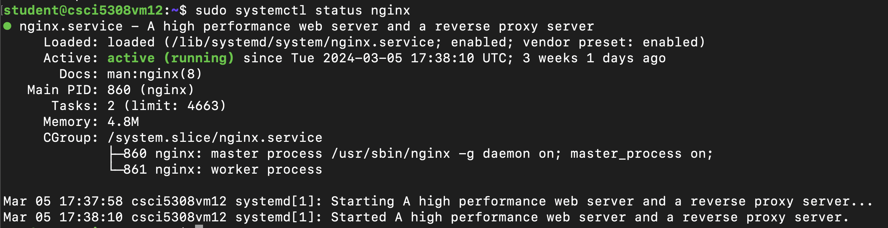

# Deployment Steps

## Overview

There are 3 core components of the application:
1. Backend in Spring Boot
2. Frontend in React
3. MySQL Database 

We have deployed our application on the virtual machine provided to us.
For backend we had used docker and for frontend we are using nginx as deployment server.

## Prerequisites
We need to have an environment with these requirements fulfilled:

- VM with Ubuntu OS

- [NGINX](https://www.nginx.com/) installed in VM

- [Docker](https://docs.docker.com/engine/install/) installed in VM 

- [Java SDK 17](https://www.oracle.com/ca-en/java/technologies/downloads/#java17) installed in VM. 
    - Note: check the version in prerequisites of development

- Check the values in [application.properties](./backend/src/main/resources/application.properties)

- Check the appropriate values in [.env](./frontend/.env)


---

### Frontend deployment steps


- Following is the nginx configuration in VM : - 

1.  Install and Start Nginx

    ```bash
    sudo systemctl start nginx
    sudo systemctl status nginx
    ```
    The above command starts the NGINX service and status shows the following:

    

    * Once the NGINX server is running, we need to change the configurations inside etc/nginx/sites-enabled folder.

        ```bash
        server {
            listen 80 default_server;
            listen [::]:80 default_server;
            access_log /var/log/nginx/app.log;
            root /var/www/build;
            index index.html index.htm;
            try_files $uri /index.html;
            location / {
                try_files $uri index.html;
            }
        }
        ```
    * Now your NGINX setup is completed


2. Change the Present Workding Directory to frontend directory and run npm install command.

    ```bash
    cd frontend
    npm install
    npm i react-icons
    ```

3. Now, we need to run the npm build command to get build package of react 

    ```bash
    npm run build
    ```

    * This step creates the build folder which has the assets, and the other frontend components like index.html.  

4. We will now move this build folder to out assigned VM's directory "/var/www/html". 

    * Run the following command to copy the build folder to the VM's NGINX serving directory.

        ```bash
        scp -r -o StrictHostKeyChecking=no -i $ID_RSA frontend/build/* ${SERVER_USER}@${SERVER_IP}:/var/www/html/
        ```
    * After copying all the build files, the NGINX will start serving the index.html on port :80 by default

---

### Backend deployment steps

- Change the direct to backend folder 

- run mvn package command to generate the war file in target folder

- Build the docker container with provided dockerfile, you can use latest image

```bash
docker build -t docker.io/tanuj3920 ecopick-backend:$CI_COMMIT_SHORT_SHA -f ./Dockerfile .
```

- Push the docker container

```bash
docker push docker.io/tanuj3920/ecopick-backend:$CI_COMMIT_SHORT_SHA
```

- connect remote VM using SSH

- remove the docker container name : "ecopick-backend"

```bash
docker container rm -f ecopick-backend
```

- Run the docker container in VM : - 

```bash
docker run -d -p 8080:8080 --name ecopick-backend docker.io/tanuj3920/ecopick-backend:$CI_COMMIT_SHORT_SHA
```

- Once the above command is run successfully, it will be accessible at 8080 port number. 

# Usage Scenario

### For Customers:

1. **Registration and Profile Setup:**

- Consumers can sign up for an account by providing basic information such as First name, Last name and Email.

2. **Exploring Farm and Farm-Products:**

- Upon successful registration, Customers can explore the farms listed on the platform.
- Consumers can also browse through a wide range of farm-fresh products listed on the platform
- They can view detailed product descriptions, including images, pricing, and farmer information.

3. **Purchasing Products:**

- Customer can select desired products, quantity and proceed to checkout.

4. **Subscription Service:**

- Customer interested in regular deliveries of their favorite products can subscribe to them.
- They can customize subscription preferences such as delivery frequency (Weekdays, Weekends or Preferred days).
- They can view and update their subscription information as needed.

5. **Wallet Service:**

- Customer have access to a digital wallet service integrated into the platform.
- They can deposit funds into their wallet and use the funds while purchasing the products.
- They can also view thier wallet history containing list of transactions.

### For Farmers:

1. **Registration and Farm Setup:**

- Consumers can sign up for an account by providing basic information such as First name, Last name and Email.
- Upon successful registration, they can set up their farm profile, including Images and Location.

2. **Listing Farm Products:**

- Farmers can add their farm products to the platform, providing detailed descriptions, images, pricing, and stock information.
- They can manage their product inventory and update listings as needed.
- They can view the list of subscribed products.

### For Admin:

1. **Admin Service**

- Upon successful login with Admin credential, admin can view the Admin Dashboard.
- On the Admin Dashboard page, they can review statistics, such as number of farms, number of products, total sales, etc.
- They can also track the Order sales and Subscription sales.